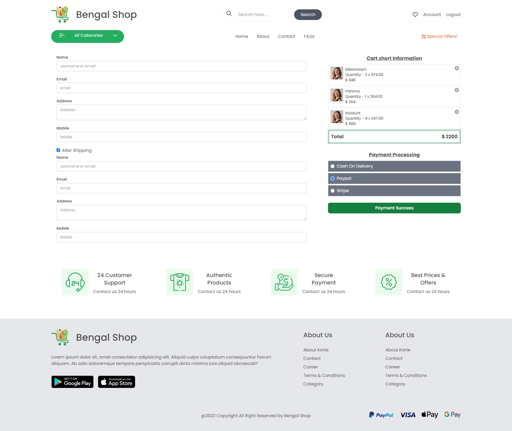

# NextJs Ecommerce make from figma Image

## This figma image get from rasal ahmed

[Link](https://www.figma.com/file/dGnV13M0DEXrcPYbpzgsjL/Bengal-Shop?node-id=0%3A1)

## File Structure

---

1. pages
2. components
3. hook

---

## Home Page

## 

---

## Product Details

## 

---

## Quick Cart

---

## Mini Cart

---

## Toggle Menu

---

## Login

---

## Register

---

## Filter Grid Product

---

## Filter Single Product

---

## Checkout

---

## Payment Processing

---

---

## Install

npm install

## rename .env.exaple file as .env then put your api link
